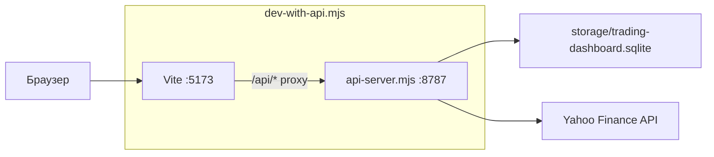
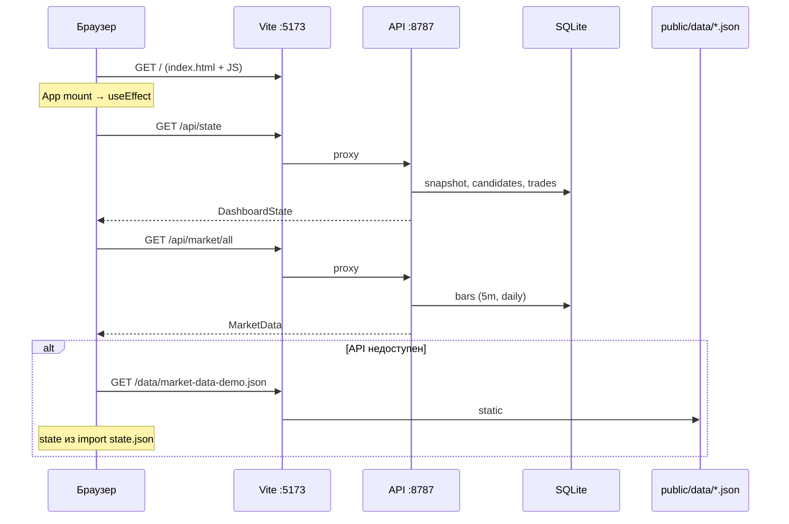
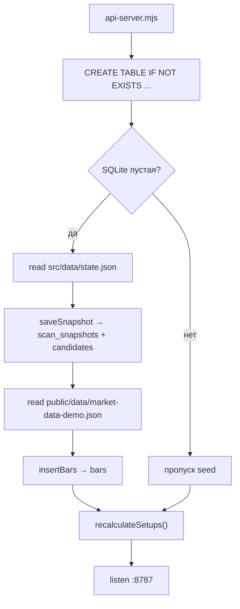
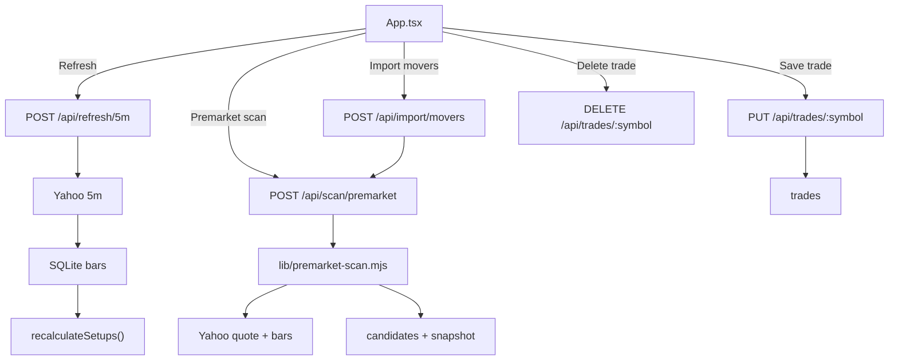
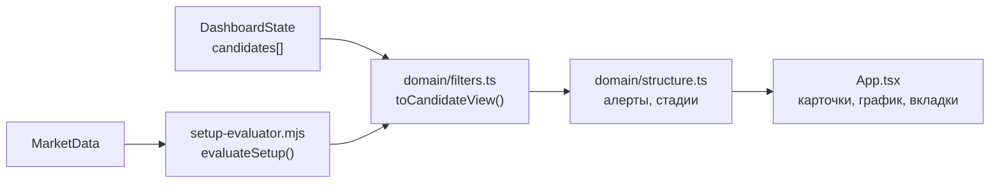

# Архитектура trading-dashboard-react

Разбор потока данных и HTTP-запросов — от запуска до UI.

## Обзор

Приложение состоит из:

| Компонент | Порт | Назначение |
|-----------|------|------------|
| **Vite dev server** | `5173` | React UI, статика из `public/` |
| **API** (`scripts/api-server.mjs`) | `8787` | REST + SQLite + Yahoo |
| **SQLite** | `storage/trading-dashboard.sqlite` | кандидаты, бары, сделки, снимки scan |

Запуск обоих процессов:

```bash
npm run dev:full   # scripts/dev-with-api.mjs
```

Только UI (без API):

```bash
npm run dev
```

Прокси API в dev-режиме — `vite.config.ts`: все запросы `/api/*` уходят на `http://127.0.0.1:8787`.

---

## Запуск: что поднимается



`dev-with-api.mjs` параллельно стартует:

1. `node scripts/api-server.mjs`
2. `npm run dev -- --host 127.0.0.1`

---

## Точка входа фронтенда

```
index.html → src/main.tsx → App.tsx
```

```tsx
// src/main.tsx
createRoot(document.getElementById('root')!).render(
  <StrictMode>
    <App />
  </StrictMode>,
)
```

`App.tsx` — монолитный корневой компонент: состояние, вкладки, график, сделки, вызовы API.

---

## Первая загрузка в браузере



### Логика в коде

При mount `App.tsx` выполняет:

1. **Сразу** — UI строится из `import stateJson from './data/state.json'` (демо watchlist в бандле).
2. **Параллельно** — `Promise.all([loadApiState(), loadApiMarketData()])`.
3. **Если API OK** — `dataSource = 'api'`, state и бары из SQLite.
4. **Если API fail** — `loadMarketData('/data/market-data-demo.json')`, `dataSource = 'static'`.

Файл: `src/services/marketData.ts` — все `fetch('/api/...')`.

---

## Инициализация API (первый старт)

При старте `api-server.mjs`:



Функции:

- `seedIfNeeded()` — один раз заливает демо-state и демо-бары.
- `recalculateSetups()` — для каждого кандидата вызывает `evaluateSetup()` по 5m барам, пишет статус и алерты.

Пути:

- State: `src/data/state.json`
- Бары для seed: `public/data/market-data-demo.json`
- БД: `storage/trading-dashboard.sqlite` (в `.gitignore`)

---

## REST API: эндпоинты

| Метод | Путь | Назначение |
|-------|------|------------|
| `GET` | `/api/health` | проверка API и БД |
| `GET` | `/api/state` | watchlist + сделки (из БД или fallback `state.json`) |
| `GET` | `/api/market/all` | все символы и OHLCV |
| `GET` | `/api/market/:symbol?tf=5m\|daily` | бары одного тикера |
| `POST` | `/api/refresh/5m` | Yahoo 5m → SQLite → recalculate |
| `POST` | `/api/refresh/daily` | Yahoo daily → SQLite |
| `POST` | `/api/recalculate/setups` | только пересчёт статусов |
| `POST` | `/api/scan/premarket` | scan universe → новый snapshot |
| `POST` | `/api/import/movers` | ручной список movers |
| `GET` | `/api/trades` | все сделки |
| `PUT` | `/api/trades/:symbol` | сохранить сделку |
| `DELETE` | `/api/trades/:symbol` | удалить сделку |

Реализация: `scripts/api-server.mjs`.

---

## Действия пользователя → запросы



### Refresh 5m

1. `refreshApiFiveMinuteData()` → `POST /api/refresh/5m`
2. `updateFiveMinuteBars()` — Yahoo Chart API для списка кандидатов
3. `recalculateSetups()` — обновление `setupStatus`, алертов
4. Клиент снова вызывает `loadApiState()` + `loadApiMarketData()`

### Premarket scan

1. `runApiPremarketScan(symbols?)` → `POST /api/scan/premarket`
2. `buildPremarketScan()` в `scripts/lib/premarket-scan.mjs`:
   - universe из `config/premarket-universe.json` (или query `?symbols=`)
   - фильтры из `config/scan-filters.json`
   - Yahoo quotes + daily + 5m
3. Новый state → `scan_snapshots` + `candidates`
4. Клиент перечитывает state и market

---

## Слой домена (как JSON становится UI)



| Модуль | Роль |
|--------|------|
| `src/domain/types.ts` | типы Candidate, SetupState, Trade, Bar |
| `src/domain/filters.ts` | валидация, `CandidateView`, core/exception |
| `src/domain/structure.ts` | алерты (`now`, `near`, `blocked`, …), подписи действий |
| `scripts/lib/setup-evaluator.mjs` | FSM сетапа по 5m барам (сервер) |
| `scripts/lib/premarket-scan.mjs` | построение кандидатов при scan |
| `scripts/lib/yahoo-market-data.mjs` | HTTP к Yahoo, нормализация баров |

---

## Вкладки UI

| Режим | Ключ | Источник данных |
|-------|------|-----------------|
| Live | `live` | текущие `candidates` |
| Premarket | `premarket` | `premarketSnapshot` |
| Post-open | `postopen` | кандидаты с post-open / прогрессом сетапа |
| Trades | `trades` | `tradeManagement` (+ API SQLite) |

Сделки дополнительно кэшируются в `localStorage` (`trading-dashboard.tradeManagement`).

---

## Внешние источники

```
https://query1.finance.yahoo.com/v8/finance/chart/{symbol}
https://query1.finance.yahoo.com/v7/finance/quote
```

Вызываются только с **сервера** (Node scripts / API), не из браузера напрямую.

---

## CLI-скрипты (без UI)

| Команда | Файл | Действие |
|---------|------|----------|
| `npm run api` | `api-server.mjs` | только API |
| `npm run update:5m` | `update-5m.mjs` | обновить 5m в SQLite |
| `npm run scan:premarket` | `scan-premarket.mjs` | scan из терминала |
| `npm run seed:state` | `seed-from-state.mjs` | залить state.json в БД |

---

## Структура каталогов

```
trading-dashboard-react/
├── src/
│   ├── main.tsx              # entry
│   ├── App.tsx               # UI + orchestration
│   ├── data/state.json       # демо state (bundled)
│   ├── domain/               # filters, structure, types
│   └── services/
│       ├── marketData.ts     # fetch API / static JSON
│       ├── trades.ts         # логика стопов сделки
│       └── tradingView.ts    # символ для TradingView
├── public/data/              # статические бары (fallback)
├── scripts/
│   ├── api-server.mjs        # HTTP API
│   ├── dev-with-api.mjs      # dev launcher
│   └── lib/                  # scan, yahoo, setup-evaluator
├── config/
│   ├── premarket-universe.json
│   └── scan-filters.json
└── storage/                  # SQLite (local, gitignored)
```

---

## Краткая цепочка «от нуля до экрана»

```
npm run dev:full
  → API: seed state.json + market-data-demo.json → SQLite
  → Vite: App.tsx mount
  → fetch /api/state + /api/market/all
  → toCandidateView + setupState → список и график
  → кнопки → POST refresh/scan → Yahoo → SQLite → GET state/market
```

---

## Связанный MVP

Старая версия без React: `../trading-dashboard/` — один `server.js:8788`, JSON на диске, без SQLite.
